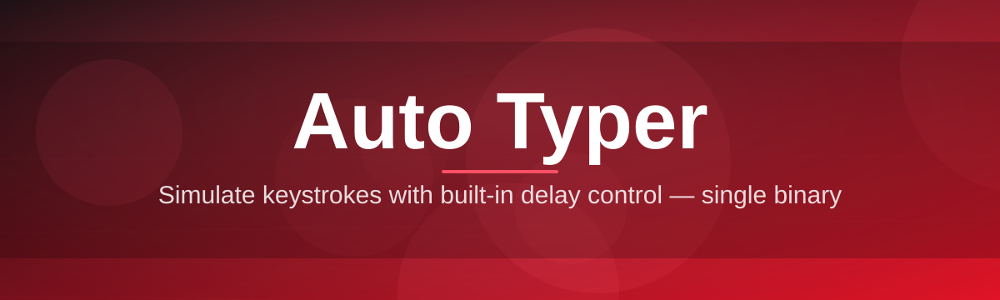
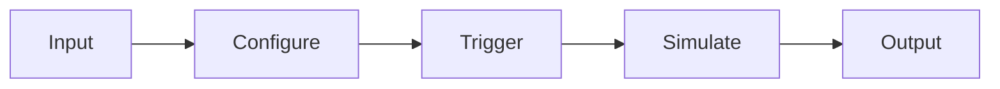

# auto-typer-tool ⌨️🚀

  

*Type once, repeat forever — the auto typer that turns tedious keystrokes into a single click.*

---

## 📖 Overview

**auto-typer-tool** is a lightweight Windows utility built for one purpose: eliminating repetitive typing. Whether you're filling out the same form fifty times a day, testing a chat application, running a macro-heavy workflow, or just tired of retyping the same block of text over and over, this auto typer sits quietly in your system tray and does the boring part for you. You write the text once, set your timing, and let the tool handle the rest — precisely, consistently, and without the fatigue that comes from doing it by hand.

The project exists because most "auto typer" tools on the internet are either bloated with ads, riddled with unnecessary background services, or simply unreliable when it comes to timing accuracy. We wanted something different: a single, self-contained executable that respects your CPU, respects your privacy, and just *works* the moment you open it. No accounts, no telemetry dashboards, no nonsense.

This tool is built for a wide range of people — QA testers simulating user input, developers stress-testing text fields, streamers automating chat responses, students filling repetitive forms, and hobbyists who just want to see their keyboard type by itself. If you've ever thought "I wish my computer could just type this for me," this project was made with you in mind.

<blockquote>

"The best automation tools are the ones you forget are running — until you realize how much time they've saved you."

</blockquote>

  

---

## ✨ What Makes It Tick

  

- **Millisecond-precise timing** — set delays down to the millisecond so your typed output matches exactly the cadence you need, whether that's blazing fast or deliberately slow.

- **Global hotkey control** — start, pause, and stop typing from anywhere on your screen without ever touching the app window.

- **Multi-line script support** — paste in entire paragraphs, scripts, or form responses and the tool handles line breaks and tab characters gracefully.

- **Loop & repeat engine** — configure the tool to type your text once, a fixed number of times, or on an infinite loop until you tell it to stop.

- **Randomized delay ranges** — add subtle variance between keystrokes so your typing rhythm feels less robotic and more natural.

- **Lightweight footprint** — the entire application is a single portable executable with no background services eating your RAM.

- **Target-window awareness** — optionally lock typing output to a specific application window so your text never leaks into the wrong place.

- **Session presets** — save multiple typing profiles (text + timing + hotkey) and switch between them instantly.

> [!TIP]
> Save your most-used scripts as presets under **Settings → Profiles**. It turns a five-step setup into a one-click launch every time you reopen the app.

---

## 🚀 How to Get Started

Getting the auto typer running takes less time than making a coffee.

1. **Visit the landing page** using the download button above or below — this always points to the current, verified build.

2. **Download the executable** to any folder you like. It's fully portable, so no installation wizard will pop up.

3. **Run the app** by double-clicking it. Windows may show a first-run SmartScreen prompt — that's expected for independently distributed tools.

4. **Paste your text, set your delay, and hit your hotkey.** You're now auto typing.

> [!NOTE]
> No admin rights are required for normal use. Some target applications with elevated privileges may require running the tool as administrator so the simulated keystrokes register correctly.

---

## 💻 System Requirements

| Component | Minimum | Recommended |
|---|---|---|
| **OS** | Windows 10 (64-bit) | Windows 11 (64-bit) |
| **RAM** | 128 MB free | 256 MB free |
| **Disk Space** | 15 MB | 30 MB |
| **Dependencies** | None — fully standalone | None |
| **.NET Runtime** | Bundled | Bundled |
| **Permissions** | Standard user | Administrator (for elevated target apps) |

<strong>📦 Why is there no installer?</strong>

 

Because a standalone auto typer doesn't need one. The app runs directly from wherever you place the executable, keeps its settings in a local config file next to it, and leaves nothing behind in your registry if you decide to delete it. Portable by design, simple by choice.

---

## ⚙️ How It Works

The internal workflow of auto-typer-tool is intentionally simple — fewer moving parts means fewer things that can go wrong.

1. **Capture** — you type or paste the text you want repeated into the input panel.
2. **Configure** — you set the delay interval, repeat count, and optional hotkey binding.
3. **Arm** — the tool waits in a low-power idle state until your trigger fires.
4. **Simulate** — keystroke events are dispatched at the OS level, matching real keyboard input.
5. **Deliver** — the text appears in your target application exactly as scheduled.

> [!IMPORTANT]
> The tool simulates real keystroke events, meaning it works with virtually any text field — browsers, chat clients, code editors, and forms alike. It does not read or modify clipboard contents unless you explicitly use the paste feature.

---

## 🧩 Troubleshooting

<strong>My hotkey isn't triggering the auto typer — what's wrong?</strong>

 

Check that no other running application has claimed the same key combination. Global hotkeys are first-come-first-served at the OS level, so a conflicting app (like a screenshot tool) can silently swallow your keypress. Try assigning a less common combination in **Settings → Hotkeys**.

<strong>The typed text is missing characters or appears jumbled.</strong>

 

This usually happens when the delay interval is set too low for the target application to keep up. Increase the per-character delay slightly — most text fields handle 10-20ms comfortably, but heavier apps (like certain Electron-based chat clients) may need 30-50ms.

<strong>Windows SmartScreen is blocking the download.</strong>

 

This is standard behavior for independently signed executables that haven't yet built up Microsoft's reputation database. Click "More info" then "Run anyway" if you trust the source — the landing page always hosts the verified, unmodified build.

<strong>Can the auto typer type into games?</strong>

 

It depends entirely on the game's input handling. Many games with standard text chat boxes work fine, but games using raw input capture for anti-automation reasons may not register simulated keystrokes. Results vary by title.

<strong>Why does typing pause randomly?</strong>

 

If you've enabled the **randomized delay range** feature, occasional longer pauses are intentional — they mimic natural human typing rhythm rather than a perfectly robotic cadence.

---

## 🎨 UI / UX Details

The interface is designed to stay out of your way while giving you full control when you need it.

### Keyboard Shortcuts

| Shortcut | Action |
|---|---|
| `F6` | Start / Resume typing |
| `F7` | Pause typing |
| `F8` | Stop typing completely |
| `Ctrl + N` | New typing profile |
| `Ctrl + S` | Save current profile |
| `Ctrl + O` | Open saved profile |
| `Ctrl + ,` | Open Settings panel |
| `Ctrl + Shift + T` | Toggle light/dark theme |
| `Esc` | Minimize to system tray |

> [!TIP]
> All shortcuts are re-bindable. Head to **Settings → Hotkeys** if the defaults clash with another tool on your system.

### Themes

- **Light Mode** — clean, high-contrast interface for daytime use.

- **Dark Mode** — easy on the eyes for long automation sessions.

- **System Sync** — automatically follows your Windows theme setting.

### Settings Highlights

- Adjustable start delay (grace period before typing begins).
- Character-by-character or line-by-line typing modes.
- Optional sound cue when a typing session completes.
- Minimize-to-tray behavior toggle.

> [!WARNING]
> Setting delays too aggressively low (under 5ms) on slower machines can cause dropped keystrokes in some applications. If you notice missing characters, this is the first setting to adjust.

---

## 🤝 Contributing & Community

This project grows because people like you use it, break it, and tell us how to make it better.

- **Found a bug?** Open an issue with your Windows version, steps to reproduce, and what you expected to happen.
- **Have an idea?** Feature requests are always welcome — describe the use case, not just the feature.
- **Want to contribute code?** Fork the repository, make your changes on a feature branch, and open a pull request with a clear description.

> [!NOTE]
> Please check existing issues before opening a new one — there's a good chance someone's already reported it, and your +1 or extra detail helps more than a duplicate.

We review contributions regularly and credit contributors in release notes. Every bit of feedback helps make this auto typer more reliable for the next person who downloads it.

---

## 📜 License

This project is licensed under the **MIT License**, 2026.

See the full license text here: [MIT License](LICENSE)

---

## ⚠️ Disclaimer

auto-typer-tool is provided for legitimate productivity, testing, and automation purposes such as form filling, QA workflows, and repetitive text entry. Users are responsible for ensuring their use of this tool complies with the terms of service of any third-party application or platform they use it alongside. The maintainers of this project are not responsible for misuse of the software or consequences resulting from violating another platform's usage policies. Use responsibly and within the bounds of applicable rules and agreements.

---

  

